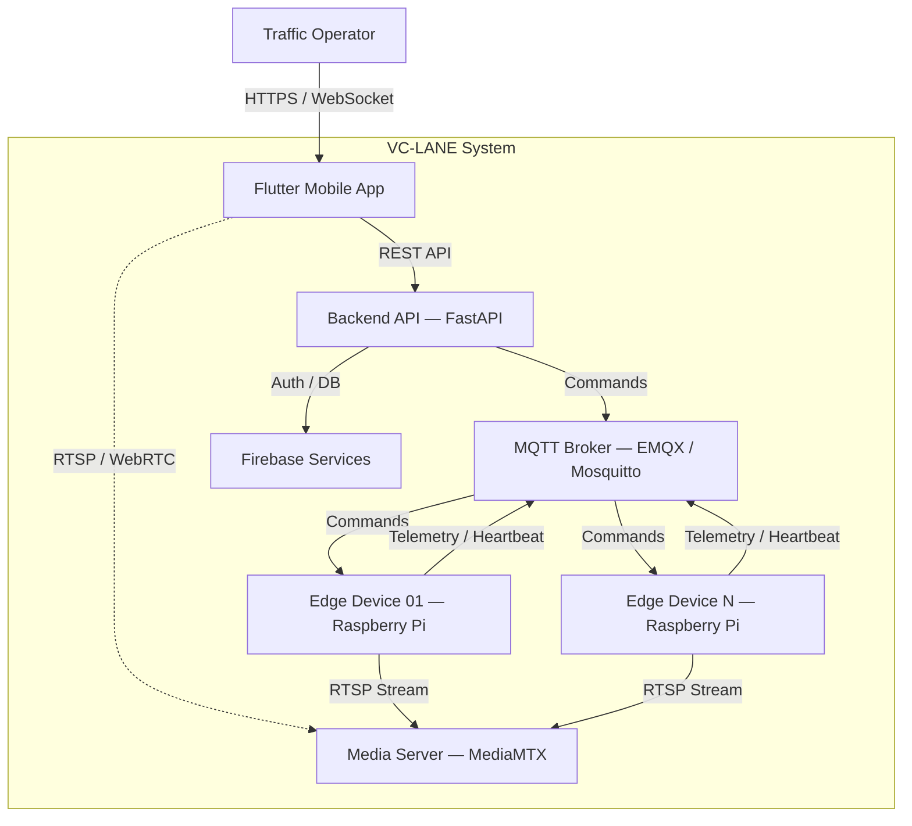

# System Architecture

```mermaid
graph TB
    User["Traffic Operator"] -->|"HTTPS / WebSocket"| App["Flutter Mobile App"]

    subgraph System["VC-LANE System"]
        App -->|"REST API"| Backend["Backend API — FastAPI"]
        App -.->|"RTSP / WebRTC"| Media["Media Server — MediaMTX"]

        Backend -->|"Commands"| MQTT["MQTT Broker — EMQX / Mosquitto"]
        Backend -->|"Auth / DB"| Firebase["Firebase Services"]

        MQTT -->|"Commands"| Edge1["Edge Device 01 — Raspberry Pi"]
        MQTT -->|"Commands"| EdgeN["Edge Device N — Raspberry Pi"]
        Edge1 -->|"Telemetry / Heartbeat"| MQTT
        EdgeN -->|"Telemetry / Heartbeat"| MQTT

        Edge1 -->|"RTSP Stream"| Media
        EdgeN -->|"RTSP Stream"| Media
    end
```
