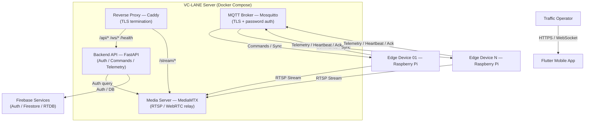

# System Architecture

```mermaid
graph TB
    User["Traffic Operator"] -->|"HTTPS / WebSocket"| App["Flutter Mobile App"]

    subgraph Server["VC-LANE Server (Docker Compose)"]
        Caddy["Reverse Proxy — Caddy<br/>(TLS termination)"]
        Backend["Backend API — FastAPI<br/>(Auth / Commands / Telemetry)"]
        Media["Media Server — MediaMTX<br/>(RTSP / WebRTC relay)"]
        MQTT["MQTT Broker — Mosquitto<br/>(TLS + password auth)"]

        Caddy -->|"/api/* /ws/* /health"| Backend
        Caddy -->|"/stream/*"| Media
        Backend -->|"Auth query"| Media
    end

    Backend -->|"Auth / DB"| Firebase["Firebase Services<br/>(Auth / Firestore / RTDB)"]
    MQTT -->|"Commands / Sync"| Edge1["Edge Device 01 — Raspberry Pi"]
    MQTT -->|"Commands / Sync"| EdgeN["Edge Device N — Raspberry Pi"]
    Edge1 -->|"Telemetry / Heartbeat / Ack"| MQTT
    EdgeN -->|"Telemetry / Heartbeat / Ack"| MQTT
    Edge1 -->|"RTSP Stream"| Media
    EdgeN -->|"RTSP Stream"| Media
```
