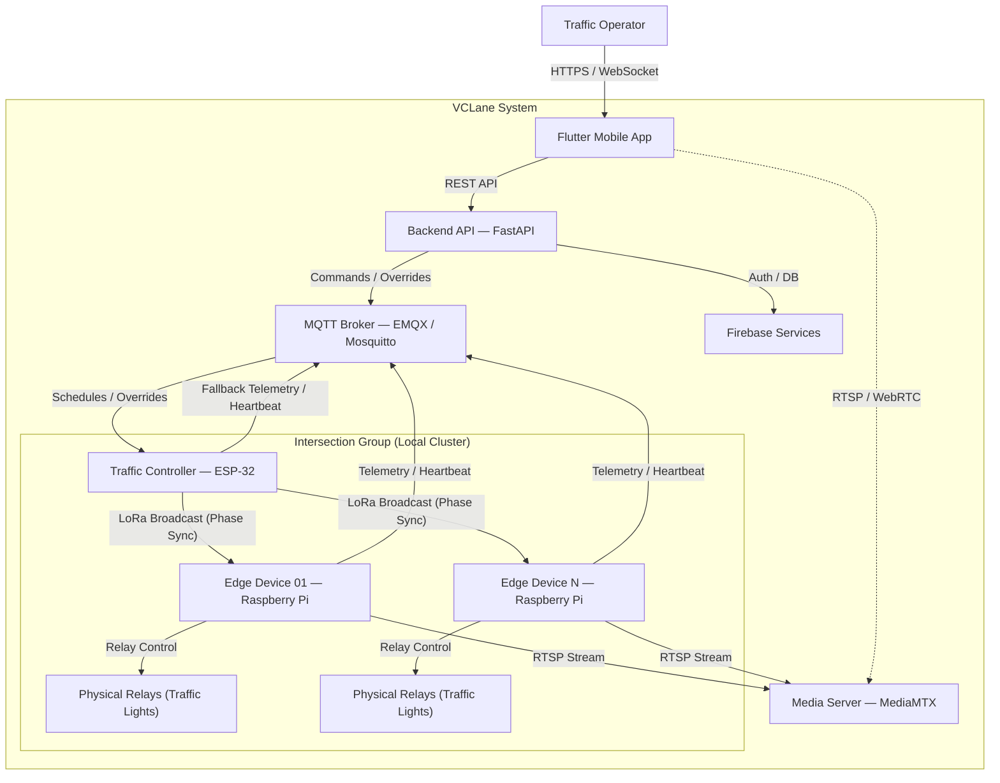

# System Architecture

## Data Flow and Communication Modes

The system operates in two main modes to balance intelligent centralized control with local off-grid resilience:

### 1. Centralized Coordinated Mode (Normal Online Flow)

Under standard operating conditions with active internet connectivity:

- **Schedule and Override Control:** The Backend API publishes group configuration, signal timing plans, and manual overrides to the MQTT broker. The **ESP-32 Traffic Controller** (connected via WiFi) subscribes to these topics, processes the schedules, and runs the local coordination logic.
- **Local Broadcast:** The ESP-32 broadcasts the target phase states (e.g., green/yellow/red durations for each lane) to the group's **Raspberry Pi Edge Devices** using LoRa.
- **Actuation:** The Raspberry Pi units receive the LoRa packets and drive the physical GPIO-connected relays to actuate the traffic signal lamps.
- **Telemetry and Streaming:** The Raspberry Pis process video streams locally, run YOLO inference for traffic analysis, and publish traffic statistics (vehicle counts, congestion levels) and device heartbeats directly to the backend via MQTT. They also stream live RTSP video feeds to the Media Server.

### 2. Autonomous Resilient Mode (Offline/Outage Fallback)

In case of connectivity interruptions:

- **Complete Internet Loss:** If the intersection group loses internet connection entirely, the **ESP-32 Traffic Controller** fails over to offline mode. Using its internal battery-backed Real-Time Clock (RTC) and cached schedules, it continues to compute phase assignments and broadcast them via LoRa. The Raspberry Pis continue to receive LoRa signals and actuate the lights, keeping the intersection cluster synchronized.
- **Edge Device Connection Loss (Fallback Telemetry):** If a Raspberry Pi Edge Device loses its internet connection but the ESP-32 remains online, the Raspberry Pi is unable to report status to the backend. The ESP-32 acts as a telemetry fallback: it publishes the group's current traffic light phase states to the MQTT broker so the backend maintains visibility of the active signal states.
