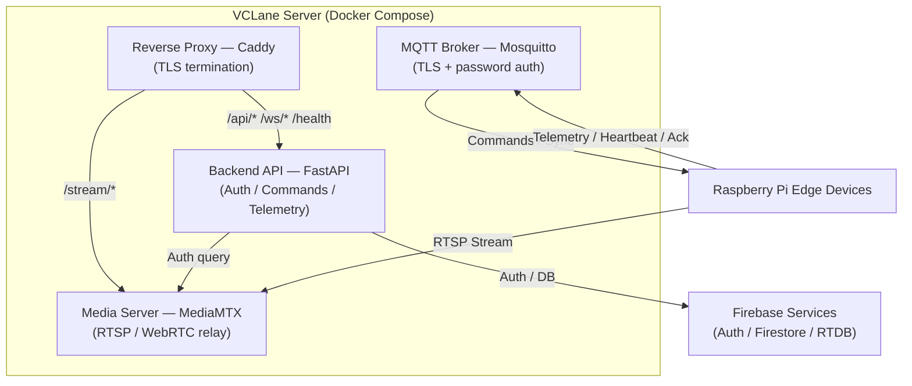

# Backend API

The backend acts as the centralized management and coordination layer between users, edge devices, and cloud services.

## Architecture



## Responsibilities

- User authentication
- Device registration
- Device management
- Traffic monitoring
- Telemetry processing
- Signal override handling
- Intersection grouping
- Traffic synchronization
- MQTT command publishing
- Firebase synchronization

## Technology Stack

| Component            | Technology                          |
| -------------------- | ----------------------------------- |
| Programming Language | Python                              |
| Backend Framework    | FastAPI                             |
| API Architecture     | REST API + WebSocket                |
| MQTT Integration     | Paho MQTT Client                    |
| MQTT Broker          | Mosquitto                           |
| Authentication       | Firebase Admin SDK + JWT + bcrypt   |
| Database             | Firestore                           |
| Real-Time Telemetry  | Realtime Database                   |
| Media Server         | MediaMTX (RTSP / WebRTC)            |
| Reverse Proxy        | Caddy                               |
| API Documentation    | OpenAPI / Swagger                   |
| Containerization     | Docker + Docker Compose             |
| Deployment           | Linux Server / Cloud Infrastructure |

## Key Features

**Device Management** — Register edge devices, manage device configurations, track device status, monitor device health, assign devices to intersections.

**Traffic Monitoring** — Receive real-time telemetry, monitor traffic conditions, store traffic information, generate traffic statistics, detect traffic events.

**Traffic Control** — Send traffic signal commands, trigger manual overrides, manage intersection schedules, coordinate multiple intersections, process command responses.

**Real-Time Synchronization** — MQTT command publishing, device heartbeat processing, WebSocket client updates, event notifications.

## REST API Endpoints

| Method   | Path                         | Auth | Purpose                                      |
| -------- | ---------------------------- | ---- | -------------------------------------------- |
| `GET`    | `/health`                    | None | Health check                                 |
| `POST`   | `/api/auth/verify`           | None | Verify Firebase ID token, return session JWT |
| `GET`    | `/api/devices`               | JWT  | List all devices                             |
| `POST`   | `/api/devices`               | JWT  | Create device + provision secret             |
| `GET`    | `/api/devices/{id}`          | JWT  | Get device details                           |
| `PATCH`  | `/api/devices/{id}`          | JWT  | Update device                                |
| `DELETE` | `/api/devices/{id}`          | JWT  | Delete device                                |
| `POST`   | `/api/devices/{id}/commands` | JWT  | Send arbitrary command                       |
| `POST`   | `/api/devices/{id}/signal`   | JWT  | Override traffic signal                      |
| `GET`    | `/api/groups`                | JWT  | List all groups                              |
| `POST`   | `/api/groups`                | JWT  | Create group                                 |
| `GET`    | `/api/groups/{id}`           | JWT  | Get group details                            |
| `PATCH`  | `/api/groups/{id}`           | JWT  | Update group                                 |
| `DELETE` | `/api/groups/{id}`           | JWT  | Delete group                                 |
| `POST`   | `/api/groups/{id}/sync`      | JWT  | Trigger group prepare                        |
| `POST`   | `/api/groups/{id}/schedule`  | JWT  | Publish + persist group schedule             |
| `GET`    | `/api/groups/{id}/schedule`  | JWT  | Get the stored group schedule                |
| `POST`   | `/api/groups/{id}/commands`  | JWT  | Send command to the group controller         |
| `GET`    | `/api/mediamtx/auth`         | None | MediaMTX auth callback                       |

See [Server Integration](server-integration.md) for details on authentication flows, MQTT communication, and component integration.

## Schedule Synchronization

Schedules are configured per intersection group and are executed locally by the group's ESP-32 Traffic Controller. The backend stores the schedule as the source of truth and delivers it to the controller over MQTT.

### Schedule Model

A schedule is a repeating loop of turns. Turn order is significant: the controller runs turn 1, then turn 2, and so on, wrapping back to turn 1 after the last turn. Phase values are simple signal lamp states: `RED`, `GREEN`, `YELLOW`.

```json
{
  "turns": [
    { "durationSeconds": 90, "phases": { "device-001": "RED",   "device-002": "GREEN", "device-003": "RED" } },
    { "durationSeconds": 90, "phases": { "device-001": "GREEN", "device-002": "RED",   "device-003": "RED" } }
  ]
}
```

Validation rules:

- `turns` must be a non-empty array
- `durationSeconds` must be a positive integer (>= 1)
- `phases` must map device IDs to `RED`, `GREEN`, or `YELLOW`

### Flow

1. **Configure:** `POST /api/groups/{id}/schedule` validates the schedule, persists it to Firestore (`groups/{id}.schedule`), and immediately publishes it to `traffic/group/{id}/schedule`.
2. **Read:** `GET /api/groups/{id}/schedule` returns the stored schedule (404 if none configured).
3. **On-connect pull:** When a controller connects, it publishes an empty message to `traffic/group/{id}/schedule-request`. The backend replies on `traffic/group/{id}/schedule` with the stored schedule, keeping the controller's cached copy (and its offline NVS fallback) in sync without periodic polling.
4. **Execution:** The ESP-32 holds each turn for `durationSeconds`, advancing through the loop continuously, and broadcasts the active phase set over LoRa to the group's edge devices.
