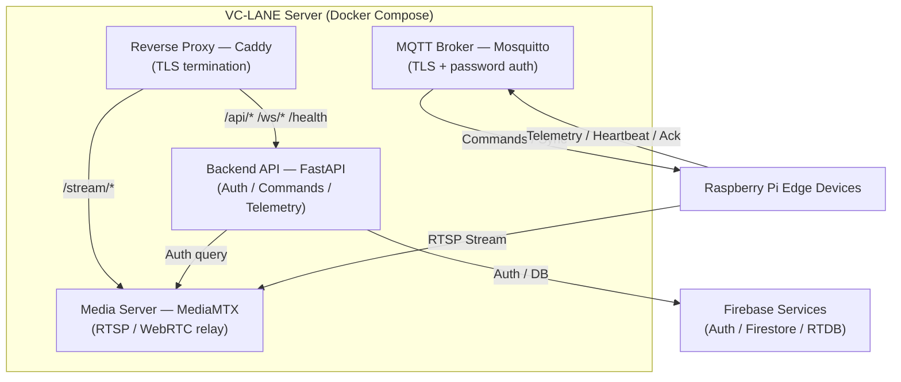

# Backend API

The backend acts as the centralized management and coordination layer between users, edge devices, and cloud services.

## Architecture

## Responsibilities

- User authentication
- Device registration
- Device management
- Traffic monitoring
- Telemetry processing
- Signal override handling
- Intersection grouping
- Traffic synchronization
- MQTT command publishing
- Firebase synchronization

## Technology Stack

| Component               | Technology                          |
| ----------------------- | ----------------------------------- |
| Programming Language    | Python                              |
| Backend Framework       | FastAPI                             |
| API Architecture        | REST API + WebSocket                |
| MQTT Integration        | Paho MQTT Client                    |
| MQTT Broker             | Mosquitto                           |
| Authentication          | Firebase Admin SDK + JWT + bcrypt   |
| Database                | Firestore                           |
| Real-Time Sensor Data   | Realtime Database                   |
| Media Server            | MediaMTX (RTSP / WebRTC)            |
| Reverse Proxy           | Caddy                               |
| API Documentation       | OpenAPI / Swagger                   |
| Containerization        | Docker + Docker Compose             |
| Deployment              | Linux Server / Cloud Infrastructure |

## Key Features

**Device Management** — Register edge devices, manage device configurations, track device status, monitor device health, assign devices to intersections.

**Traffic Monitoring** — Receive real-time telemetry, monitor traffic conditions, store traffic information, generate traffic statistics, detect traffic events.

**Traffic Control** — Send traffic signal commands, trigger manual overrides, manage intersection schedules, coordinate multiple intersections, process command responses.

**Real-Time Synchronization** — MQTT command publishing, device heartbeat processing, WebSocket client updates, event notifications.

## REST API Endpoints

| Method | Path | Auth | Purpose |
|---|---|---|---|
| `GET` | `/health` | None | Health check |
| `POST` | `/api/auth/verify` | None | Verify Firebase ID token, return session JWT |
| `GET` | `/api/devices` | JWT | List all devices |
| `POST` | `/api/devices` | JWT | Create device + provision secret |
| `GET` | `/api/devices/{id}` | JWT | Get device details |
| `PATCH` | `/api/devices/{id}` | JWT | Update device |
| `DELETE` | `/api/devices/{id}` | JWT | Delete device |
| `POST` | `/api/devices/{id}/commands` | JWT | Send arbitrary command |
| `POST` | `/api/devices/{id}/signal` | JWT | Override traffic signal |
| `GET` | `/api/groups` | JWT | List all groups |
| `POST` | `/api/groups` | JWT | Create group |
| `GET` | `/api/groups/{id}` | JWT | Get group details |
| `PATCH` | `/api/groups/{id}` | JWT | Update group |
| `DELETE` | `/api/groups/{id}` | JWT | Delete group |
| `POST` | `/api/groups/{id}/sync` | JWT | Trigger group prepare |
| `GET` | `/api/mediamtx/auth` | None | MediaMTX auth callback |

See [Server Integration](server-integration.md) for details on authentication flows, MQTT communication, and component integration.
