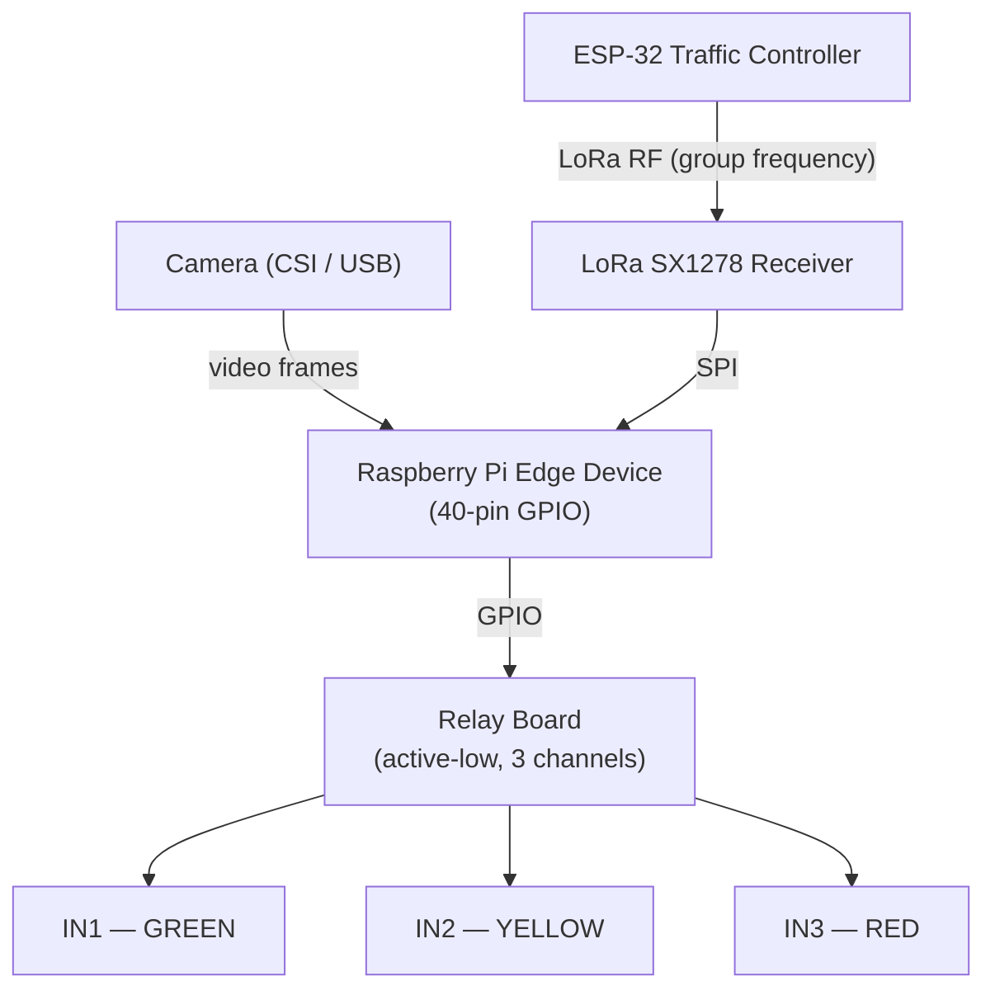
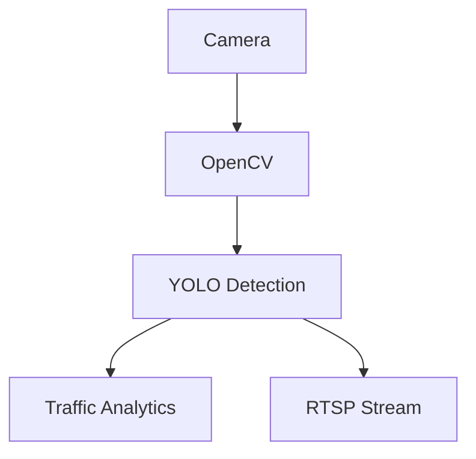

# Raspberry Pi Edge Device

Each intersection contains an independent Raspberry Pi-based edge device acting as the intelligent edge computing unit. It performs video processing, AI inference, traffic analysis, device communication, and local decision-making.

## Hardware Wiring

An intersection node connects three peripherals to the Raspberry Pi: the **LoRa receiver** (listens for phase broadcasts from the group's ESP-32 Traffic Controller), the **relay board** (drives the green/yellow/red signal lamps), and the **camera** (feeds the video/YOLO pipeline).



### LoRa module (SX1276 / SX1278)

The LoRa module connects to the Raspberry Pi over SPI. The pins below match the `lora_cs_pin` / `lora_rst_pin` defaults.

| LoRa signal | Pi 40-pin header | BCM GPIO |
| ----------- | ---------------- | -------- |
| `3.3V`      | Pin 1            | —        |
| `GND`       | Any GND pin      | —        |
| `SCK`       | Pin 23           | 11       |
| `MOSI`      | Pin 19           | 10       |
| `MISO`      | Pin 21           | 9        |
| `CS` (NSS)  | Pin 22           | 25       |
| `RST`       | Pin 13           | 27       |

- Set `lora_frequency_mhz` to your region's band (433 / 868 / 915 MHz) and match the ESP-32 controller's spreading factor, bandwidth, and coding rate — otherwise packets will not decode.
- The driver uses the RadioHead-compatible sync word `0x12` (the RadioLib default on the ESP-32); the module's DIO0 pin is not required.

### Relay board

A 3-channel, active-low relay board drives the signal lamps. The pins below match the `relay_pins` defaults (`green`=17, `yellow`=18, `red`=22).

| Relay board | Signal lamp | Pi 40-pin header | BCM GPIO |
| ----------- | ----------- | ---------------- | -------- |
| `IN1`       | green       | Pin 11           | 17       |
| `IN2`       | yellow      | Pin 12           | 18       |
| `IN3`       | red         | Pin 15           | 22       |
| `VCC`       | —           | Separate supply  | —        |
| `GND`       | —           | Any GND pin      | —        |

- Most relay boards are **active-low** (a LOW GPIO signal energizes the coil) — keep `relay_active_high: false`.
- Relays draw significant current: power the board from a dedicated 5 V / 12 V supply and connect only the signal pins to the Pi.

### Camera

- **USB camera**: plug into any USB port and set `video_source` to the device index (e.g. `"0"`).
- **Raspberry Pi Camera Module**: connect the ribbon cable to the CSI connector and enable the camera interface; set `video_source` to the camera device.

The default pins are chosen to avoid the SPI bus (GPIO 8–11) and the LoRa CS/RST pins (GPIO 25/27). If you rewire any peripheral, update `lora_cs_pin`, `lora_rst_pin`, or `relay_pins` to match.

## Video Processing

The edge device handles all camera-related operations.

Responsibilities:

- Capture live camera feeds
- Process frames using OpenCV
- Perform object detection using YOLO
- Detect vehicles and pedestrians
- Calculate traffic density
- Generate traffic statistics
- Publish live video streams

Data flow:



## AI-Based Traffic Analysis

The edge device performs local AI inference instead of sending raw video to the backend.

Advantages:

- Lower bandwidth usage
- Lower latency
- Faster response time
- Reduced cloud processing cost

Examples:

- Vehicle counting
- Lane occupancy detection
- Queue length estimation
- Traffic congestion detection

## Local Decision Making and Actuation

Under the grouped architecture, the Raspberry Pi Edge Device functions as the physical actuator for the traffic lights at its intersection. Rather than executing a standalone schedule or receiving direct signal overrides from the backend, it delegates coordination to the group's ESP-32 Traffic Controller.

Key behaviors:

- **LoRa Packet Reception:** The Raspberry Pi continuously listens for LoRa broadcast signals containing the target active phases.
- **Relay Actuation:** It parses the received command (e.g., active phase, green-yellow-red light configurations) and controls the physical relays to update the signal lamps.
- **Resilient Fallback:** If the LoRa broadcast signal is lost (e.g., ESP-32 hardware failure), the Raspberry Pi falls back to a pre-programmed local safety routine (such as flashing yellow for caution) to prevent unsafe signal states.

## Backend Communication

The edge device maintains a persistent MQTT connection to the backend when internet is available.

Responsibilities:

- Publish AI traffic telemetry (vehicle count, traffic density)
- Report the currently actuated traffic light phase (from LoRa) or caution state
- Send heartbeat updates (process uptime and timestamp)

Example telemetry:

```json
{
  "deviceId": "intersection-01",
  "vehicleCount": 35,
  "trafficDensity": "HIGH",
  "currentTrafficLightSignal": "GREEN",
  "timestamp": "2026-07-24T10:00:00Z"
}
```

## Device Monitoring

Each edge device periodically reports its status to the backend over MQTT:

- **Telemetry** (`traffic/device/{deviceId}/telemetry`): current vehicle count, traffic density, and the active traffic light signal (or `CAUTION` during fallback)
- **Heartbeat** (`traffic/device/{deviceId}/heartbeat`): process uptime and timestamp

## Software Architecture

### Project Layout

```
vclane-edge/
├── src/vclane_edge/
│   ├── __init__.py          # Version
│   ├── cli.py               # Typer CLI (run, register, deregister)
│   ├── config.py            # VclaneSettings + load_settings()
│   ├── device.py            # VclaneEdgeDevice orchestrator
│   ├── mqtt.py              # MQTT client (publish/subscribe)
│   ├── video.py             # Video pipeline (3 modes)
│   ├── yolo.py              # YOLO detection wrapper
│   ├── telemetry.py         # Mock telemetry state
│   ├── lora.py              # LoRa receiver (ESP-32 phase broadcasts)
│   ├── relay.py             # Relay actuation + caution fallback
│   └── registration.py      # Provisioning flow
├── pyproject.toml            # uv-managed deps
├── Dockerfile                # Multi-stage container
└── docker-compose.yml        # Edge device service
```

### CLI Commands

The edge device exposes three commands via the `vclane-edge` entry point:

| Command                  | Description                                        |
| ------------------------ | -------------------------------------------------- |
| `vclane-edge run`        | Run video pipeline, YOLO inference, MQTT telemetry |
| `vclane-edge register`   | Provision device with backend API                  |
| `vclane-edge deregister` | Remove device from backend                         |

All options are documented inline with `--help`.

### Configuration

Settings are resolved from two sources (highest priority wins):

1. **JSON config file** — passed via `--config / -c` (e.g. `vclane-edge run --config config.json`)
2. **CLI flags** — `--device-id`, `--mqtt-host`, etc.

Example `config.json`:

```json
{
  "device_id": "intersection-01",
  "device_secret": "…from registration…",
  "mqtt_host": "10.0.0.5",
  "mqtt_port": 8883,
  "mqtt_tls": true,
  "api_url": "https://vclane.example.com"
}
```

### Video Pipeline Modes

| Mode                      | Description                                                            |
| ------------------------- | ---------------------------------------------------------------------- |
| `opencv+ffmpeg` (default) | OpenCV capture → YOLO detect → FFmpeg stdin → RTSP                     |
| `direct-ffmpeg`           | Source → FFmpeg → RTSP (no OpenCV/YOLO, pure passthrough)              |
| `opencv+gstreamer`        | OpenCV capture → YOLO → GStreamer → RTSP (falls back to opencv+ffmpeg) |

### Registration Flow

1. Admin runs `vclane-edge register --api-url <url>`
2. Prompts for Firebase email/password (or sets `VCLANE_ADMIN_EMAIL` / `VCLANE_ADMIN_PASSWORD`)
3. `POST /api/auth/login` → JWT
4. `POST /api/devices` → receives `{deviceId, deviceSecret, rtspUrl}`
5. With `--out <path>`, credentials saved as JSON; otherwise printed to stdout

Auto-registration at `vclane-edge run` start occurs when `device_id` or `device_secret` are empty (or `force_register` is `true`). Registered credentials are used in-memory for the session — the config file is not modified.

## Technology Stack

| Component                   | Technology                     |
| --------------------------- | ------------------------------ |
| Hardware                    | Raspberry Pi                   |
| Operating System            | Raspberry Pi OS / Linux        |
| Programming Language        | Python                         |
| Video Processing            | OpenCV                         |
| AI Detection Model          | YOLO Object Detection          |
| AI Runtime                  | Ultralytics YOLO (PyTorch)     |
| Camera Interface            | CSI Camera / USB Camera        |
| Local Wireless Receiver     | LoRa SX1276 / SX1278 Module    |
| Local Control Protocol      | SPI (Pi to LoRa) / LoRa Radio  |
| Actuator Interface          | GPIO-controlled Relay Board    |
| MQTT Communication          | Eclipse Paho MQTT Client       |
| Communication Protocol      | MQTT over TLS (to Backend)     |
| Video Streaming             | RTSP Publisher                 |
| Containerization (Optional) | Docker                         |

## Key Features

**AI-Based Traffic Analysis** — Vehicle detection, pedestrian detection, traffic density estimation, lane occupancy detection, queue length estimation, congestion detection.

**Local Edge Processing** — Performs AI inference locally, reduces bandwidth consumption, provides faster response time, minimizes cloud processing requirements.

**LoRa-Driven Signal Actuation** — Receives synchronized traffic light phase commands from the group's ESP-32 Traffic Controller via LoRa, driving the physical light relays.

**Fault Tolerant Safety Fallback** — Reverts to flashing yellow/local caution mode if LoRa control signals are lost or corrupted, ensuring driver safety.

**Device Monitoring** — Periodic telemetry (vehicle count, traffic density, active signal) and heartbeat reporting (uptime, timestamp).

**Secure Backend Communication** — Device heartbeat reporting, telemetry publishing, remote configuration updates.
