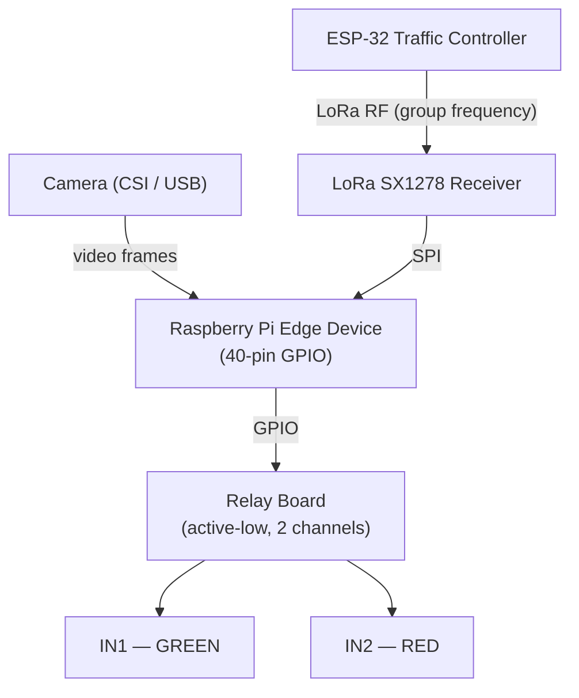
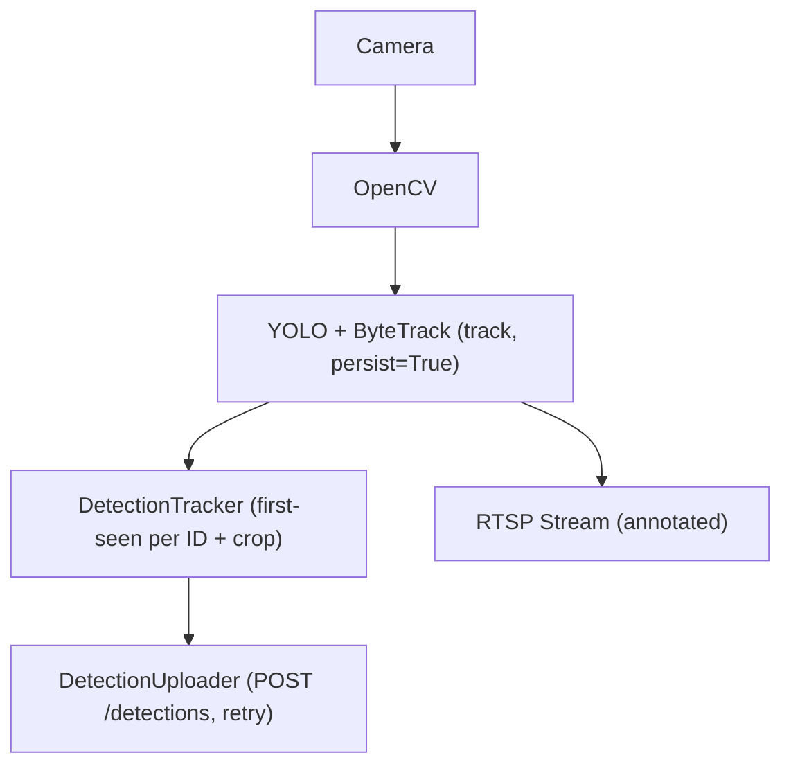

# Raspberry Pi Edge Device

Each intersection contains an independent Raspberry Pi-based edge device acting as the intelligent edge computing unit. It performs video processing, AI inference, traffic analysis, device communication, and local decision-making.

## Phase Sync Transport (`sync_transport`)

Phase frames (`{gid, seq, ts, p, ttl, ov}`) can arrive via LoRa radio (default) or via the MQTT `traffic/group/{groupId}/phase` topic (QoS 1, retained) — both feed one shared `seq`-dedup state (first-valid wins). `ov` is `true` while an override is active (5 relay blinks), `false` otherwise (3 blinks); missing `ov` defaults to `false`.

| `sync_transport` | Behavior |
| ---------------- | -------- |
| `lora` (default) | LoRa receiver only; needs SX1276/SX1278 wiring below |
| `mqtt` | MQTT phase subscription only; no LoRa hardware needed, but requires broker connectivity |
| `dual` | Accepts either transport; useful for migration |

- Set via config `sync_transport` or CLI `--sync-transport`.
- The caution fallback (`lora_timeout`, default 5 s without any valid phase packet) applies to both transports.
- In `mqtt`/`dual` modes the existing MQTT connection gains one extra subscription; no new credentials.

## Hardware Wiring

An intersection node connects up to three peripherals to the Raspberry Pi: the **LoRa receiver** (listens for phase broadcasts from the group's ESP-32 Traffic Controller — only needed when `sync_transport` is `lora`/`dual`), the **relay board** (drives the green/red signal lamps), and the **camera** (feeds the video/YOLO pipeline).


```mermaid
graph TD
    ESP32["ESP-32 Traffic Controller"] -->|"LoRa RF (group frequency)"| LORA["LoRa SX1278 Receiver"]
    CAM["Camera (CSI / USB)"] -->|"video frames"| PI["Raspberry Pi Edge Device<br/>(40-pin GPIO)"]
    LORA -->|"SPI"| PI
    PI -->|"GPIO"| RELAY["Relay Board<br/>(active-low, 2 channels)"]
    RELAY --> IN1["IN1 — GREEN"]
    RELAY --> IN2["IN2 — RED"]
```

### LoRa module (SX1276 / SX1278)

The LoRa module connects to the Raspberry Pi over SPI. The pins below match the `lora_cs_pin` / `lora_rst_pin` defaults.

| LoRa signal | Pi 40-pin header | BCM GPIO |
| ----------- | ---------------- | -------- |
| `3.3V`      | Pin 1            | —        |
| `GND`       | Any GND pin      | —        |
| `SCK`       | Pin 23           | 11       |
| `MOSI`      | Pin 19           | 10       |
| `MISO`      | Pin 21           | 9        |
| `CS` (NSS)  | Pin 22           | 25       |
| `RST`       | Pin 13           | 27       |

- Set `lora_frequency_mhz` to your region's band (433 / 868 / 915 MHz) and match the ESP-32 controller's spreading factor, bandwidth, and coding rate — otherwise packets will not decode.
- The driver uses the RadioHead-compatible sync word `0x12` (the RadioLib default on the ESP-32); the module's DIO0 pin is not required.

### Relay board

A 2-channel, active-low relay board drives the signal lamps. The pins below match the `relay_pins` defaults (`green`=17, `red`=22).

| Relay board | Signal lamp | Pi 40-pin header | BCM GPIO |
| ----------- | ----------- | ---------------- | -------- |
| `IN1`       | green       | Pin 11           | 17       |
| `IN2`       | red         | Pin 15           | 22       |
| `VCC`       | —           | Separate supply  | —        |
| `GND`       | —           | Any GND pin      | —        |

- Most relay boards are **active-low** (a LOW GPIO signal energizes the coil) — keep `relay_active_high: false`.
- Relays draw significant current: power the board from a dedicated 5 V / 12 V supply and connect only the signal pins to the Pi.

### Camera

- **USB camera**: plug into any USB port and set `video_source` to the device index (e.g. `"0"`).
- **Raspberry Pi Camera Module**: connect the ribbon cable to the CSI connector and enable the camera interface; set `video_source` to the camera device.

The default pins are chosen to avoid the SPI bus (GPIO 8–11) and the LoRa CS/RST pins (GPIO 25/27). If you rewire any peripheral, update `lora_cs_pin`, `lora_rst_pin`, or `relay_pins` to match.

## Video Processing

The edge device handles all camera-related operations.

Responsibilities:

- Capture live camera feeds
- Process frames using OpenCV
- Run YOLO + ByteTrack tracking with persistent IDs
- Emit one per-vehicle detection event per new tracked ID (first sighting, any YOLO label) with JPEG crop
- Generate traffic statistics (signal + emergency flag only; no aggregate counts)
- Publish live annotated video streams (boxes + track IDs)

Data flow:


```mermaid
graph TD
    Camera --> OpenCV
    OpenCV --> TRACK["YOLO + ByteTrack (track, persist=True)"]
    TRACK --> Detect["DetectionTracker (first-seen per ID + crop)"]
    Detect --> Upload["DetectionUploader (POST /detections, retry)"]
    TRACK --> RTSP["RTSP Stream (annotated)"]
```

Set `yolo_enabled: false` for raw passthrough with no inference (or `stream_mode: direct-ffmpeg`).

## AI-Based Traffic Analysis

The edge device performs local AI inference instead of sending raw video to the backend.

Advantages:

- Lower bandwidth usage
- Lower latency
- Faster response time
- Reduced cloud processing cost

Examples:

- Vehicle detection events (one per new tracked ID, with JPEG crop)
- Lane occupancy detection
- Queue length estimation
- Traffic congestion detection
- Per-direction and per-class breakdowns

### Vehicle Tracking (YOLO + ByteTrack, default)

Tracking runs with `tracker: "bytetrack.yaml"` out of the box — `YOLODetector.track()` calls `model.track(persist=True, tracker=...)`, preserving Kalman state across frames. Requires the `lap` dependency (`pip install lap` / `uv sync`).

- Annotated boxes show `{label} #{track_id} {conf:.2f}` (e.g. `car #7 0.82`).
- **Frame ordering matters:** an ordered inference queue (`maxsize=1`, blocking `put(timeout=0.05)`) preserves sequence for the Kalman filter.
- **`yolo_interval` is 1 or 2** (config-validated; `1` = every frame accuracy, `2` = every 2nd frame perf). Larger skips break the Kalman state and cause ID switches.
- **Stream gaps reset IDs:** on EOF / reconnect (`read_frame()` returns `None`), `reset_tracker()` clears ByteTrack state so stale tracks do not leak into the new sequence.
- Verify manually with `python scripts/test_tracking.py --source <video|0> [--save out.mp4]` (defaults: `--model models/best.pt --conf 0.4 --imgsz 416 --tracker bytetrack.yaml`).

CLI flags:

| Flag | Description |
| ---- | ----------- |
| `--tracker <yaml>` | Tracker config (default `bytetrack.yaml`) |
| `--yolo-interval <N>` | Run YOLO every N frames (`1` accuracy, `2` perf) |

### Per-Vehicle Detection Events (`detection.py`)

`src/vclane_edge/detection.py` layers eventing on top of ByteTrack IDs (no aggregate counts):

- **Trigger** — first sighting of each ByteTrack ID emits one `DetectionEvent` (any YOLO label, unfiltered) with a padded JPEG crop. Seen IDs are remembered until a stream gap resets them.
- **Upload** — `DetectionUploader` POSTs each event immediately via `POST /api/devices/{id}/detections` (bounded queue, drop-oldest on overflow, retry offline with backoff).
- **Emergency** — the same tracker debounces `emergency_classes` over `emergency_min_frames` consecutive sightings per vehicle for override requests.

## Local Decision Making and Actuation

Under the grouped architecture, the Raspberry Pi Edge Device functions as the physical actuator for the traffic lights at its intersection. Rather than executing a standalone schedule or receiving direct signal overrides from the backend, it delegates coordination to the group's ESP-32 Traffic Controller.

Key behaviors:

- **Phase Reception:** The Raspberry Pi listens for phase broadcasts via the configured `sync_transport` — LoRa packets and/or MQTT `traffic/group/{groupId}/phase` frames containing the target active phases plus the `ov` override flag.
- **Relay Actuation:** It parses the received command (e.g., active phase, green/red light configurations) and controls the physical relays to update the signal lamps. Via `apply_phase(phase, is_override)`: duplicate phases are ignored (the 1 s heartbeat re-broadcasts the same `seq`); otherwise the new lamp blinks on/off × N — 3 blinks when `ov` is `false`, 5 when `ov` is `true` — on a relay worker thread under the relay lock, then latches solid so the 1 s signal/telemetry loop is not blocked. Entering caution aborts any in-progress blink and goes all-off with no blink; the first valid phase after boot goes straight solid.
- **Resilient Fallback:** If the phase signal is lost (LoRa out of range / ESP-32 failure, or MQTT broker unreachable in `mqtt` mode), the Raspberry Pi falls back to a pre-programmed local safety routine (such as all relays off for caution) to prevent unsafe signal states.

## Backend Communication

The edge device maintains a persistent MQTT connection to the backend when internet is available.

Responsibilities:

- Publish lean AI traffic telemetry (emergency-vehicle flag + active signal only; no counts — history lives in `detections`)
- Report the currently actuated traffic light phase (from LoRa) or caution state
- Send heartbeat updates (process uptime and timestamp)
- Submit per-vehicle detections via `POST /api/devices/{id}/detections` (one multipart request per new ByteTrack ID: `trackId`, `class`, `deviceTimestamp`, required `image` crop; bounded queue, hold/retry offline).

> Dynamic queue gate triggers off `POST /api/devices/{id}/detections` (new-doc only), not telemetry. Dedup is server-side via doc-ID existence + RTDB `has_queued_schedule` — the edge keeps uploading normally and never tracks queue state itself.

Example telemetry:

```json
{
  "deviceId": "intersection-01",
  "currentTrafficLightSignal": "GREEN",
  "emergencyVehicleDetected": false,
  "emergencyClass": "",
  "emergencyConfidence": 0.0,
  "timestamp": "2026-07-24T10:00:00Z"
}
```

When an emergency vehicle (`ambulance`, `fire truck`, `police car` by default) is visible, `emergencyVehicleDetected` is `true` with the top-match `emergencyClass` / `emergencyConfidence` (e.g. `"ambulance"`, `0.91`).

### Emergency Vehicle Override

When YOLO reports an `emergency_classes` label (`ambulance`, `fire truck`, `police car` by default) above `emergency_confidence` for `emergency_min_frames` consecutive sightings, the edge sets the telemetry emergency flag and sends one `signal_override` request per distinct vehicle (ByteTrack ID) via the existing `POST /api/groups/{id}/commands` endpoint (`durationSeconds: 60` by default, no cancel — the override expires naturally). Auth reuses `POST /api/auth/login` with `admin_email` / `admin_password` (or `VCLANE_ADMIN_EMAIL` / `VCLANE_ADMIN_PASSWORD`). Requires `api_url` + `group_id` + admin credentials; without them the device sets the telemetry flag only. A global `emergency_cooldown_s` (default 60 s) suppresses redundant POSTs while an override is active.

## Device Monitoring

Each edge device periodically reports its status to the backend over MQTT:

- **Telemetry** (`traffic/device/{deviceId}/telemetry`): active signal (or `CAUTION` during fallback) + emergency-vehicle flag (`emergencyVehicleDetected` / `emergencyClass` / `emergencyConfidence`). No counts. Dynamic queue trigger moved to `POST /api/devices/{id}/detections`.
- **Heartbeat** (`traffic/device/{deviceId}/heartbeat`): process uptime and timestamp

## Software Architecture

### Project Layout

```
vclane-edge/
├── src/vclane_edge/
│   ├── __init__.py          # Version
│   ├── cli.py               # Typer CLI (run, register, deregister)
│   ├── config.py            # VclaneSettings + load_settings()
│   ├── device.py            # VclaneEdgeDevice orchestrator
│   ├── mqtt.py              # MQTT client (publish/subscribe)
│   ├── video.py             # Video pipeline (3 modes)
│   ├── yolo.py              # YOLO detection + ByteTrack wrapper (track/reset_tracker/annotate)
│   ├── detection.py         # DetectionTracker (per-vehicle events) + DetectionUploader (REST queue)
│   ├── telemetry.py         # Telemetry state (signal + emergency flag only)
│   ├── backend_api.py       # Backend HTTP client (auth, provisioning, commands, detections)
│   ├── signal_override.py   # Override scheduler (cooldown + worker thread)
│   ├── lora.py              # LoRa receiver (ESP-32 phase broadcasts)
│   ├── relay.py             # Relay actuation + caution fallback
│   ├── backend_api.py       # Backend HTTP client (auth, provisioning, commands)
├── scripts/
│   └── test_tracking.py     # Manual ByteTrack verification (--source <video|0> [--save out.mp4])
├── pyproject.toml            # uv-managed deps (includes `lap` for ByteTrack association)
├── Dockerfile                # Multi-stage container
└── docker-compose.yml        # Edge device service
```

### CLI Commands

The edge device exposes three commands via the `vclane-edge` entry point:

| Command                  | Description                                        |
| ------------------------ | -------------------------------------------------- |
| `vclane-edge run`        | Run video pipeline, YOLO inference, MQTT telemetry |
| `vclane-edge register`   | Provision device with backend API                  |
| `vclane-edge deregister` | Remove device from backend                         |

All options are documented inline with `--help`.

### Configuration

Settings are resolved from two sources (highest priority wins):

1. **JSON config file** — passed via `--config / -c` (e.g. `vclane-edge run --config config.json`)
2. **CLI flags** — `--device-id`, `--mqtt-host`, etc.

Example `config.json`:

```json
{
  "device_id": "intersection-01",
  "device_secret": "…from registration…",
  "mqtt_host": "10.0.0.5",
  "mqtt_port": 8883,
  "mqtt_tls": true,
  "api_url": "https://vclane.example.com",
  "tracker": "bytetrack.yaml",
  "yolo_interval": 1,
  "detections_enabled": true,
  "detections_max_queue": 200,
  "relay_blink_normal": 3,
  "relay_blink_override": 5,
  "relay_blink_interval": 0.5
}
```

`tracker` is required (default `bytetrack.yaml`); `yolo_interval` is validated to 1–2 (`1` accuracy, `2` perf). Set `yolo_enabled: false` (or `stream_mode: direct-ffmpeg`) for raw passthrough with no inference.

`relay_blink_normal` / `relay_blink_override` select the blink count before latching solid (3 on schedule transitions, 5 when the phase frame has `ov: true`); `relay_blink_interval` is the seconds per on/off step.

### Video Pipeline Modes

| Mode                      | Description                                                            |
| ------------------------- | ---------------------------------------------------------------------- |
| `opencv+ffmpeg` (default) | OpenCV capture → YOLO track → FFmpeg stdin → RTSP                     |
| `direct-ffmpeg`           | Source → FFmpeg → RTSP (no OpenCV/YOLO, pure passthrough)              |
| `opencv+gstreamer`        | OpenCV capture → YOLO → GStreamer → RTSP (falls back to opencv+ffmpeg) |

### Registration Flow

1. Admin runs `vclane-edge register --api-url <url>`
2. Prompts for Firebase email/password (or sets `VCLANE_ADMIN_EMAIL` / `VCLANE_ADMIN_PASSWORD`)
3. `POST /api/auth/login` → JWT
4. `POST /api/devices` → receives `{deviceId, deviceSecret, rtspUrl}`
5. With `--out <path>`, credentials saved as JSON; otherwise printed to stdout

Auto-registration at `vclane-edge run` start occurs when `device_id` or `device_secret` are empty (or `force_register` is `true`). Registered credentials are used in-memory for the session — the config file is not modified.

## Technology Stack

| Component                   | Technology                     |
| --------------------------- | ------------------------------ |
| Hardware                    | Raspberry Pi                   |
| Operating System            | Raspberry Pi OS / Linux        |
| Programming Language        | Python                         |
| Video Processing            | OpenCV                         |
| AI Detection Model          | YOLO Object Detection + ByteTrack multi-object tracking |
| AI Runtime                  | Ultralytics YOLO (PyTorch) + `lap` (ByteTrack association) |
| Camera Interface            | CSI Camera / USB Camera        |
| Local Wireless Receiver     | LoRa SX1276 / SX1278 Module    |
| Local Control Protocol      | SPI (Pi to LoRa) / LoRa Radio  |
| Actuator Interface          | GPIO-controlled Relay Board    |
| MQTT Communication          | Eclipse Paho MQTT Client       |
| Communication Protocol      | MQTT over TLS (to Backend)     |
| Video Streaming             | RTSP Publisher                 |
| Containerization (Optional) | Docker                         |

## Key Features

**AI-Based Traffic Analysis** — Vehicle detection, ByteTrack multi-object tracking with persistent IDs, per-vehicle detection events with image crops, pedestrian detection, lane occupancy detection, queue length estimation, congestion detection.

**Local Edge Processing** — Performs AI inference locally, reduces bandwidth consumption, provides faster response time, minimizes cloud processing requirements.

**LoRa-Driven Signal Actuation** — Receives synchronized traffic light phase commands from the group's ESP-32 Traffic Controller via LoRa (default) or MQTT phase topic, driving the physical green/red relays.

**Fault Tolerant Safety Fallback** — Reverts to all relays off/local caution mode if phase control signals are lost or corrupted, ensuring driver safety.

**Device Monitoring** — Periodic lean telemetry (active signal, emergency-vehicle flag) and heartbeat reporting (uptime, timestamp).

**Secure Backend Communication** — Device heartbeat reporting, telemetry publishing, remote configuration updates.
