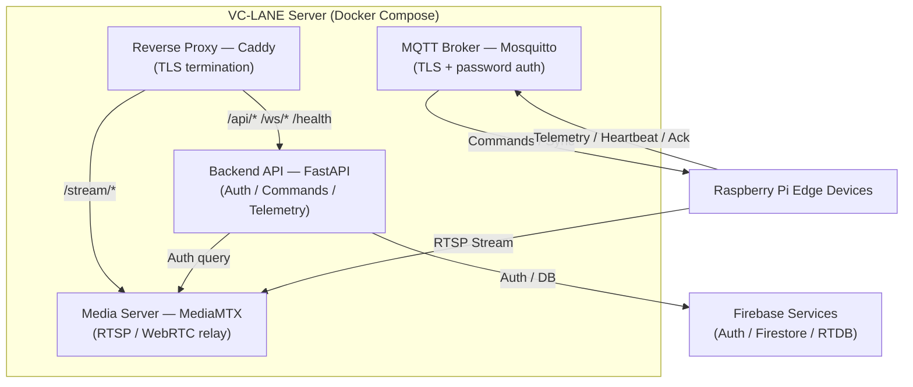
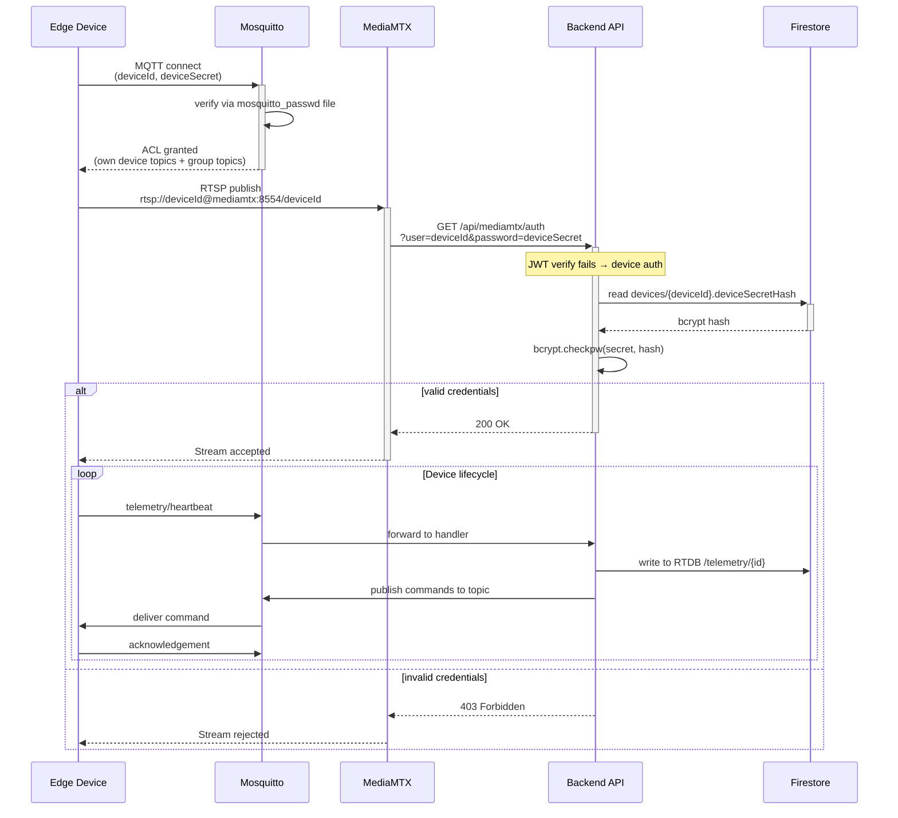

# Server Integration

The VC-LANE server is a Docker Compose stack of four services — Caddy, Backend (FastAPI), MediaMTX, and Mosquitto — that work together to manage edge devices, relay video streams, and handle real-time communication.

## Backend API

The backend acts as the centralized management and coordination layer between users, edge devices, and cloud services.

### Architecture



### Responsibilities

- User authentication
- Device registration
- Device management
- Traffic monitoring
- Telemetry processing
- Signal override handling
- Intersection grouping
- Traffic synchronization
- MQTT command publishing
- Firebase synchronization

### Technology Stack

| Component               | Technology                          |
| ----------------------- | ----------------------------------- |
| Programming Language    | Python                              |
| Backend Framework       | FastAPI                             |
| API Architecture        | REST API + WebSocket                |
| MQTT Integration        | Paho MQTT Client                    |
| MQTT Broker             | Mosquitto                           |
| Authentication          | Firebase Admin SDK + JWT + bcrypt   |
| Database                | Firestore                           |
| Real-Time Telemetry     | Realtime Database                   |
| Media Server            | MediaMTX (RTSP / WebRTC)            |
| Reverse Proxy           | Caddy                               |
| API Documentation       | OpenAPI / Swagger                   |
| Containerization        | Docker + Docker Compose             |
| Deployment              | Linux Server / Cloud Infrastructure |

### Key Features

**Device Management** — Register edge devices, manage device configurations, track device status, monitor device health, assign devices to intersections.

**Traffic Monitoring** — Receive real-time telemetry, monitor traffic conditions, store traffic information, generate traffic statistics, detect traffic events.

**Traffic Control** — Send traffic signal commands, trigger manual overrides, manage intersection schedules, coordinate multiple intersections, process command responses.

**Real-Time Synchronization** — MQTT command publishing, device heartbeat processing, WebSocket client updates, event notifications.

## Backend ↔ MediaMTX Authentication

MediaMTX is configured to delegate authentication to the backend via HTTP callbacks.

### Configuration

```yaml
# provisions/mediamtx/mediamtx.dev.yml
authMethods:
  - http
authHTTPAddress: http://backend:8000/api/mediamtx/auth
```

On every RTSP publish or play action, MediaMTX issues an HTTP GET to the backend:

```
GET /api/mediamtx/auth?user={user}&password={password}&action={action}&path={path}
```

### Auth Flow

The backend tries two strategies in order:

1. **JWT session auth** — treats `user` as a session token, verified via `verify_session_token()`. Used by human operators viewing streams through the mobile app.
2. **Device secret auth** — looks up `devices/{deviceId}` in Firestore, retrieves `deviceSecretHash`, verifies the `password` field with bcrypt. Used by edge devices publishing streams.

Both strategies return `200 OK` on success or `403 Forbidden` on failure. No path-level or action-level authorization is enforced beyond credential verification.

### RTSP URL Format

When a device is provisioned, it receives an RTSP URL of the form:

```
rtsp://{deviceId}@mediamtx:8554/{deviceId}
```

- The `deviceId` serves as the RTSP username (sent as `user` in the auth callback).
- The `deviceSecret` serves as the RTSP password (sent as `password`).
- The path (same as `deviceId`) is used by MediaMTX to identify the stream.

---

## Backend ↔ MQTT (Mosquitto)

The backend connects to Mosquitto as an internal MQTT client to receive telemetry from devices and publish commands.

### Connection

- Client ID: `vclane-backend`
- Host: `mosquitto:1883` (internal Docker network, no TLS)
- No password — the backend user is authorized via ACL

### Subscriptions

On connect, the backend subscribes to four wildcard topics:

| Topic Pattern | Handler | Destination |
|---|---|---|
| `traffic/device/+/telemetry` | `_handle_telemetry` | Writes to RTDB at `/telemetry/{deviceId}` via `ref.set(payload)` |
| `traffic/device/+/heartbeat` | `_handle_heartbeat` | Writes to RTDB at `/telemetry/{deviceId}` (same as telemetry) |
| `traffic/device/+/acknowledgements` | `_handle_ack` | Logs the payload — no persistence or callback |
| `traffic/group/+/prepare-response` | _(no handler)_ | Subscribed but not processed |

All inbound handlers parse the topic to extract `deviceId` (third segment) and route accordingly.

### Publish (Outbound)

| Trigger | Topic | Payload |
|---|---|---|
| `POST /api/devices/{id}/commands` | `traffic/device/{id}/commands` | `{"command": "...", "payload": {...}}` |
| `POST /api/devices/{id}/signal` | `traffic/device/{id}/commands` | `{"command": "signal_override", "payload": {"targetSignal": "..."}}` |
| `POST /api/groups/{id}/sync` | `traffic/group/{id}/prepare` | `{"deviceIds": ["id1", "id2", ...]}` |

---

## Backend ↔ Edge Devices (via MQTT)

### Device Provisioning Flow

1. Admin calls `POST /api/devices` (JWT required) with `{deviceId, name, location}`.
2. Backend generates a device secret: `vcl-{32 hex chars}`.
3. Secret is bcrypt-hashed and stored in Firestore at `devices/{deviceId}.deviceSecretHash`.
4. RTSP URL is constructed: `rtsp://{deviceId}@mediamtx:8554/{deviceId}`.
5. Mosquitto user is created via `mosquitto_passwd -b <passwd_file> <deviceId> <secret>`.
6. Response returns `{deviceId, deviceSecret, rtspUrl}` — the plaintext secret is only returned once.

### Device Authentication (End-to-End)



### Command Formats

**Signal override** (published on device creation or via `POST /api/devices/{id}/signal`):

```json
{
  "command": "signal_override",
  "payload": {
    "targetSignal": "green"
  }
}
```

The backend also writes a Firestore document to `signalOverrides/{id}` with `{deviceId, targetSignal, requestedBy, status: "active", requestedAt, expiresAt}` (expires in 1 hour). Expiration is not enforced by the backend — the edge device is expected to honor it.

**Group sync** (published on `POST /api/groups/{id}/sync`):

```json
{
  "deviceIds": ["intersection-01", "intersection-02"]
}
```

Edge devices in the group respond on `traffic/group/{groupId}/prepare-response`.

---

## MQTT Topic Reference

| Direction | Topic | Publisher | Consumer | Payload |
|---|---|---|---|---|
| Device → Backend | `traffic/device/{id}/telemetry` | Edge device | Backend (→RTDB) | Arbitrary JSON |
| Device → Backend | `traffic/device/{id}/heartbeat` | Edge device | Backend (→RTDB) | Arbitrary JSON |
| Device → Backend | `traffic/device/{id}/acknowledgements` | Edge device | Backend (logged) | Arbitrary JSON |
| Device → Backend | `traffic/group/{id}/prepare-response` | Edge device | Backend (unhandled) | Arbitrary JSON |
| Backend → Device | `traffic/device/{id}/commands` | Backend | Edge device | `{"command": str, "payload": {}}` |
| Backend → Devices | `traffic/group/{id}/prepare` | Backend | Edge devices in group | `{"deviceIds": [str]}` |

### Mosquitto ACL

The ACL file controls topic-level access:

```
# provisions/mosquitto/acl.dev.conf

user vclane-backend
  pattern rw traffic/device/+/#
  pattern rw traffic/group/+/#

pattern read write traffic/device/%u/#
pattern read write traffic/group/+/#
```

- `vclane-backend` (the backend's MQTT client) has read/write on all device and group topics.
- `%u` in the pattern line expands to the connecting device's username (= `deviceId`), scoping each device to its own topics.
- All devices can read/write group topics for synchronization.

---

## Integration API Endpoints

| Method | Path | Auth | Purpose | Side-Effect |
|---|---|---|---|---|
| `POST` | `/api/devices` | JWT | Create device + provision secret | `add_mosquitto_user()` via shell |
| `DELETE` | `/api/devices/{id}` | JWT | Delete device | `remove_mosquitto_user()` via shell |
| `POST` | `/api/devices/{id}/commands` | JWT | Send arbitrary command | MQTT publish to `traffic/device/{id}/commands` |
| `POST` | `/api/devices/{id}/signal` | JWT | Override traffic signal | MQTT publish + Firestore write |
| `POST` | `/api/groups/{id}/sync` | JWT | Trigger group prepare | MQTT publish to `traffic/group/{id}/prepare` |
| `GET` | `/api/mediamtx/auth` | _(none)_ | MediaMTX auth callback | Reads Firestore, bcrypt verify |
