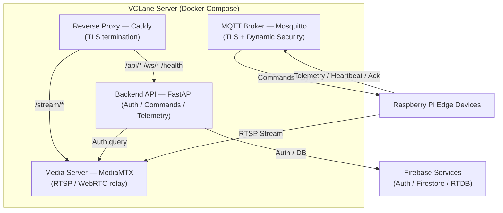
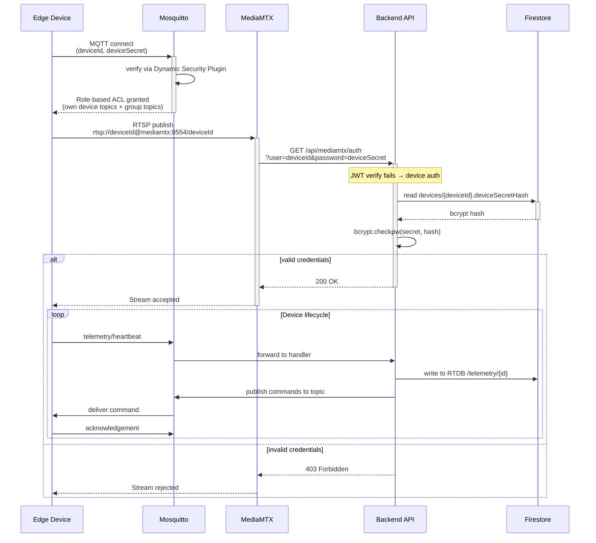

# Server Integration

The VCLane server is a Docker Compose stack of four services — Caddy, Backend (FastAPI), MediaMTX, and Mosquitto — that work together to manage edge devices, relay video streams, and handle real-time communication.

## Backend API

The backend acts as the centralized management and coordination layer between users, edge devices, and cloud services.

### Architecture


```mermaid
graph TB
    subgraph Server["VCLane Server (Docker Compose)"]
        Caddy["Reverse Proxy — Caddy<br/>(TLS termination)"]
        Backend["Backend API — FastAPI<br/>(Auth / Commands / Telemetry)"]
        Media["Media Server — MediaMTX<br/>(RTSP / WebRTC relay)"]
        MQTT["MQTT Broker — Mosquitto<br/>(TLS + Dynamic Security)"]

        Caddy -->|"/api/* /ws/* /health"| Backend
        Caddy -->|"/stream/*"| Media
        Backend -->|"Auth query"| Media
    end

    Backend -->|"Auth / DB"| Firebase["Firebase Services<br/>(Auth / Firestore / RTDB)"]
    MQTT -->|"Commands / Sync"| Edge["Raspberry Pi Edge Devices"]
    Edge -->|"Telemetry / Heartbeat / Ack"| MQTT
    Edge -->|"RTSP Stream"| Media
```

### Responsibilities

- User authentication
- Device registration
- Device management
- Traffic monitoring
- Telemetry processing
- Signal override handling
- Intersection grouping
- Traffic synchronization
- MQTT command publishing
- Firebase synchronization

### Technology Stack

| Component            | Technology                          |
| -------------------- | ----------------------------------- |
| Programming Language | Python                              |
| Backend Framework    | FastAPI                             |
| API Architecture     | REST API + WebSocket                |
| MQTT Integration     | Paho MQTT Client                    |
| MQTT Broker          | Mosquitto                           |
| Authentication       | Firebase Admin SDK + JWT + bcrypt   |
| Database             | Firestore                           |
| Real-Time Telemetry  | Realtime Database                   |
| Media Server         | MediaMTX (RTSP / WebRTC)            |
| Reverse Proxy        | Caddy                               |
| API Documentation    | OpenAPI / Swagger                   |
| Containerization     | Docker + Docker Compose             |
| Deployment           | Linux Server / Cloud Infrastructure |

### Key Features

**Device Management** — Register edge devices, manage device configurations, track device status, monitor device health, assign devices to intersections.

**Traffic Monitoring** — Receive real-time telemetry, monitor traffic conditions, store traffic information, generate traffic statistics, detect traffic events.

**Traffic Control** — Send traffic signal commands, trigger manual overrides, manage intersection schedules, coordinate multiple intersections, process command responses.

**Real-Time Synchronization** — MQTT command publishing, device heartbeat processing, WebSocket client updates, event notifications.

## Backend ↔ MediaMTX Authentication

MediaMTX is configured to delegate authentication to the backend via HTTP callbacks.

### Configuration

```yaml
# provisions/mediamtx/mediamtx.dev.yml
authMethods:
  - http
authHTTPAddress: http://backend:8000/api/mediamtx/auth
```

On every RTSP publish or play action, MediaMTX issues an HTTP GET to the backend:

```
GET /api/mediamtx/auth?user={user}&password={password}&action={action}&path={path}
```

### Auth Flow

The backend tries two strategies in order:

1. **JWT session auth** — treats `user` as a session token, verified via `verify_session_token()`. Used by human operators viewing streams through the mobile app.
2. **Device secret auth** — looks up `devices/{deviceId}` in Firestore, retrieves `deviceSecretHash`, verifies the `password` field with bcrypt. Used by edge devices publishing streams.

Both strategies return `200 OK` on success or `403 Forbidden` on failure. No path-level or action-level authorization is enforced beyond credential verification.

### RTSP URL Format

When a device is provisioned, it receives an RTSP URL of the form:

```
rtsp://{deviceId}@mediamtx:8554/{deviceId}
```

- The `deviceId` serves as the RTSP username (sent as `user` in the auth callback).
- The `deviceSecret` serves as the RTSP password (sent as `password`).
- The path (same as `deviceId`) is used by MediaMTX to identify the stream.

---

## Backend ↔ MQTT (Mosquitto)

The backend connects to Mosquitto as an internal MQTT client to receive telemetry from devices and publish commands.

### Connection

- Client ID: `vclane-backend`
- Host: `mosquitto:1883` (internal Docker network, no TLS)
- Password: `vclane-backend` — matches the admin client bootstrapped in the Dynamic Security config
- The `admin` role grants access to all traffic topics plus `$CONTROL/dynamic-security/#` for Dynamic Security administration

### Subscriptions

On connect, the backend subscribes to the wildcard topics below plus the Dynamic Security response topic:

| Topic Pattern                       | Handler                   | Destination                                                                                                |
| ----------------------------------- | ------------------------- | ---------------------------------------------------------------------------------------------------------- |
| `traffic/device/+/telemetry`        | `_handle_telemetry`       | Writes to RTDB at `/telemetry/{deviceId}` — injects `online: true` and `lastSeen` (no queue gate)          |
| `traffic/device/+/heartbeat`        | `_handle_heartbeat`       | Same as telemetry (no queue gate)                                                                          |
| `traffic/device/+/status`           | `_handle_device_status`   | Retained LWT/status topic — `online: true` refreshes `online` + `lastSeen`; `online: false` marks the device offline |
| `traffic/device/+/goodbye`          | `_handle_goodbye`         | Sets `online: false` on `/telemetry/{deviceId}` (legacy firmware path)                                     |
| `traffic/device/+/acknowledgements` | `_handle_ack`             | Logs the payload — no persistence or callback                                                              |
| `traffic/group/+/queue-done`        | `_handle_queue_done`      | Processes controller `queueDoneDeviceId` → clears `has_queued_schedule`                                    |
| `traffic/group/+/prepare-response`  | _(no handler)_            | Subscribed but not processed                                                                               |

All inbound handlers parse the topic to extract `deviceId` (third segment) and route accordingly.

### Publish (Outbound)

| Trigger                           | Topic                          | Payload                                                                              |
| --------------------------------- | ------------------------------ | ------------------------------------------------------------------------------------ |
| `POST /api/devices/{id}/commands` | `traffic/device/{id}/commands` | `{"command": "...", "payload": {...}}`                                               |
| `POST /api/devices/{id}/signal`   | `traffic/device/{id}/commands` | `{"command": "signal_override", "payload": {"targetSignal": "..."}}`                 |
| `POST /api/groups/{id}/commands`  | `traffic/group/{id}/commands`  | `{"command": "signal_override", "payload": {"phases": {...}, "durationSeconds": N}}` |
| `POST /api/groups/{id}/sync`      | `traffic/group/{id}/prepare`   | `{"deviceIds": ["id1", "id2", ...]}`                                                 |
| Dynamic queue gate (auto)         | `traffic/group/{gid}/commands` | `{"command": "enqueue", "payload": {"deviceId": "..."}}` — admin `forceEnqueue` bypasses the gate and `enqueueEdgeDetections` |

---

## Backend ↔ Edge Devices (via MQTT)

### Device Provisioning Flow

1. Admin calls `POST /api/devices` (JWT required) with `{deviceId, name, location}`.
2. Backend generates a device secret: `vcl-{32 hex chars}`.
3. Secret is bcrypt-hashed and stored in Firestore at `devices/{deviceId}.deviceSecretHash`.
4. RTSP URL is constructed: `rtsp://{deviceId}@mediamtx:8554/{deviceId}`.
5. Mosquitto user is created via two Dynamic Security RPCs: `publish_dynsec("createClient", ...)` to create the MQTT client, then `publish_dynsec("addClientRole", ...)` to assign the `device` role.
6. Response returns `{deviceId, deviceSecret, rtspUrl}` — the plaintext secret is only returned once.

### Device Authentication (End-to-End)


```mermaid
sequenceDiagram
    participant Edge as Edge Device
    participant MQTT as Mosquitto
    participant MTX as MediaMTX
    participant API as Backend API
    participant DB as Firestore

    Edge->>+MQTT: MQTT connect<br/>(deviceId, deviceSecret)
    MQTT->>MQTT: verify via Dynamic Security Plugin
    MQTT-->>-Edge: Role-based ACL granted<br/>(own device topics + group topics)

    Edge->>+MTX: RTSP publish<br/>rtsp://deviceId@mediamtx:8554/deviceId
    MTX->>+API: GET /api/mediamtx/auth<br/>?user=deviceId&password=deviceSecret
    Note over API: JWT verify fails → device auth

    API->>+DB: read devices/{deviceId}.deviceSecretHash
    DB-->>-API: bcrypt hash
    API->>API: bcrypt.checkpw(secret, hash)

    alt valid credentials
        API-->>-MTX: 200 OK
        MTX-->>-Edge: Stream accepted

        loop Device lifecycle
            Edge->>MQTT: telemetry/heartbeat
            MQTT->>API: forward to handler
            API->>DB: write to RTDB /telemetry/{id}
            API->>MQTT: publish commands to topic
            MQTT->>Edge: deliver command
            Edge->>MQTT: acknowledgement
        end
    else invalid credentials
        API-->>MTX: 403 Forbidden
        MTX-->>Edge: Stream rejected
    end
```

### Command Formats

**Signal override** (published on device creation or via `POST /api/devices/{id}/signal`):

```json
{
  "command": "signal_override",
  "payload": {
    "targetSignal": "green"
  }
}
```

The backend also writes a Firestore document to `signalOverrides/{id}` with `{deviceId, targetSignal, requestedBy, status: "active", requestedAt, expiresAt}` (expires in 1 hour). Expiration is not enforced by the backend — the edge device is expected to honor it.

**Group command (signal override / cancel)** — published on `POST /api/groups/{id}/commands` to `traffic/group/{id}/commands`:

```json
{ "command": "signal_override", "payload": { "phases": { "device-001": "GREEN", "device-002": "RED" }, "durationSeconds": 30 } }
{ "command": "cancel_override", "payload": {} }
```

`durationSeconds` `0` is indefinite; a positive value is a fixed duration; a negative value causes the controller to reject the whole command. The ESP-32 pauses its schedule turn-loop (or the dynamic queue) while an override is active and uses the override phases in its place. Device IDs omitted from `phases` are not broadcast, so those edge devices enter caution/solid RED; the device-level `POST /api/devices/{id}/signal` path fills the rest of the group with the inverse signal. On expiry/cancel the controller resumes the same turn (or the interrupted queue phase) but restarts its full duration — remaining time is not preserved.

Group commands are fire-and-forget: any authenticated user may send them, the backend returns `202 {"status": "sent", "groupId": ...}` without validating `command`/`payload`, and no `signalOverrides` audit document is written (only the device-level `/signal` endpoint writes one).

**Queue enqueue (dynamic mode)** — published automatically by the queue gate to `traffic/group/{groupId}/commands`:

```json
{ "command": "enqueue", "payload": { "deviceId": "intersection-01" } }
```

The controller appends exactly one FIFO entry per `enqueue` and does **not** dedupe: duplicates and the currently-GREEN device are accepted, so a queue of `cam1 | cam1 | cam2` serves all three in order. Only an empty `deviceId` or a full queue (16 entries) is rejected. Normal edge detections are deduped upstream via `has_queued_schedule`; an admin `forceEnqueue` bypasses that dedup.

**Group sync** (published on `POST /api/groups/{id}/sync`):

```json
{
  "deviceIds": ["intersection-01", "intersection-02"]
}
```

Edge devices in the group respond on `traffic/group/{groupId}/prepare-response`.

### Dynamic Queue Gate (per-group `schedulingMode: "dynamic"`)

No new topics — the gate triggers off `POST /api/devices/{id}/detections` (new docs only). Telemetry never triggers enqueue.

**Authorization:** `forceEnqueue=true` requires `users/{uid}.role == "admin"` (the JWT carries only `sub`); otherwise the endpoint returns `403` before writing anything.

**On `POST /api/devices/{deviceId}/detections` (new doc, not `deduped:true`):**

```
group = Firestore lookup via devices/{deviceId}.groupId (already resolved)
if group is None or group.schedulingMode != "dynamic": return  # store only
if request.forceEnqueue:
    # wins over enqueueEdgeDetections and skips every check below
    enqueue
elif group.enqueueEdgeDetections is false:
    return                              # audit-only: store the detection
else:
    if class not in vehicle allowlist: return   # pedestrians must not queue
    if now - deviceTimestamp > 180s: return     # stale offline retry → store only
    if currentTrafficLightSignal not in {RED, CAUTION}: return  # already served
    if has_queued_schedule == true: return      # dedup a pending/ongoing serve
    enqueue

enqueue:
    publish {"command": "enqueue", "payload": {"deviceId"}} to traffic/group/{groupId}/commands
    RTDB update /telemetry/{deviceId}: {has_queued_schedule: true, queuedAt: now}
```

A gate failure is logged and never changes the `201`; the detection's `enqueued` audit field records the outcome. `forceEnqueue` still requires `schedulingMode: "dynamic"` — against a `fixed` group it stores only, because the controller ignores `enqueue` outside dynamic mode.

**On `traffic/group/{groupId}/queue-done` with `queueDoneDeviceId`:**

```
RTDB update /telemetry/{queueDoneDeviceId}: {has_queued_schedule: false, queuedAt: null}
```

When the controller's FIFO empties it broadcasts all-RED; no backend action is needed for the idle state. `has_queued_schedule` is a per-device boolean, not a per-entry counter: with duplicate forced entries the first completion clears it while another duplicate may still be pending.

---

## MQTT Topic Reference

| Direction            | Topic                                  | Publisher         | Consumer                      | Payload                                                                               |
| -------------------- | -------------------------------------- | ----------------- | ----------------------------- | ------------------------------------------------------------------------------------- |
| Device → Backend     | `traffic/device/{id}/telemetry`        | Edge device       | Backend (→RTDB)               | Lean telemetry JSON (signal + emergency flag; no counts, no queue trigger) |
| Device → Backend     | `traffic/device/{id}/heartbeat`        | Edge device       | Backend (→RTDB)               | Arbitrary JSON                                                                        |
| Device → Backend     | `traffic/device/{id}/acknowledgements` | Edge device       | Backend (logged)              | Arbitrary JSON                                                                        |
| Device → Backend     | `traffic/group/{id}/prepare-response`  | Edge device       | Backend (unhandled)           | Arbitrary JSON                                                                        |
| Controller → Backend | `traffic/group/{id}/schedule-request`  | ESP-32 controller | Backend                       | Empty (on connect)                                                                    |
| Controller → Backend | `traffic/group/{id}/queue-done`        | ESP-32 controller | Backend (queue clear)         | `queueDoneDeviceId`, `queueDepth`                                                     |
| Controller → Backend | `traffic/group/{id}/heartbeat`         | ESP-32 controller | Backend                       | Uptime + timestamp JSON                                                               |
| Backend → Controller | `traffic/group/{id}/schedule`          | Backend           | ESP-32 controller             | Schedule JSON (turns loop + schedulingMode + dynamicConfig)                           |
| Backend → Controller | `traffic/group/{id}/commands`          | Backend           | ESP-32 controller             | `{"command": str, "payload": {}}` (`signal_override` / `cancel_override` / `enqueue`) |
| Backend → Device     | `traffic/device/{id}/commands`         | Backend           | Edge device                   | `{"command": str, "payload": {}}`                                                     |
| Backend → Devices    | `traffic/group/{id}/prepare`           | Backend           | Edge devices in group         | `{"deviceIds": [str]}`                                                                |

### Mosquitto Dynamic Security

Mosquitto uses the **Dynamic Security Plugin** instead of static ACL files. Two roles are bootstrapped at image build:

- **`admin`** — assigned to `vclane-backend`, grants read/write on all `traffic/device/+/#` and `traffic/group/+/#` topics plus CONTROL topics.
- **`device`** — applied per device, grants read/write on `traffic/device/%u/#` and `traffic/group/+/#` topics.

#### RPC Format

Dynamic Security commands are sent as MQTT RPCs on `$CONTROL/dynamic-security/v1`. The payload must wrap the command in a `commands` array:

```json
{
  "commands": [
    {
      "command": "createClient",
      "username": "intersection-01",
      "password": "vcl-abc123...",
      "textname": "intersection-01"
    }
  ]
}
```

A single `"command"` key at the top level (without the `commands` array) will cause an `"Unknown command"` / `"Invalid/missing commands"` error on Mosquitto 2.1.2.

Success responses omit both `"success"` and `"error"` keys — only the response fields (e.g., `"clients"` for `listClients`). Failure responses include an `"error"` key.

#### Provisioning Flow

When a device is provisioned via `POST /api/devices`, the backend sends **two** RPCs:

1. `createClient` — registers the MQTT client with username/password
2. `addClientRole` — assigns the `device` role to the newly created client

On deprovisioning (`DELETE /api/devices/{id}`), a single `deleteClient` RPC removes the client and its role assignments.

#### Docker Volume Persistence

The `mosquitto_data` Docker volume at `/mosquitto/data` in the container persists the Dynamic Security database file (`dynamic-security.json`) across container restarts. To apply a fresh image config (e.g., after rebuilding with new roles/ACLs), the volume must be deleted:

```bash
docker compose down mosquitto
docker volume rm vclane-server_mosquitto_data
docker compose up -d mosquitto
```

---

## Integration API Endpoints

| Method   | Path                           | Auth     | Purpose                          | Side-Effect                                                      |
| -------- | ------------------------------ | -------- | -------------------------------- | ---------------------------------------------------------------- |
| `POST`   | `/api/devices`                 | JWT      | Create device + provision secret | `add_mosquitto_user()` via Dynamic Security RPC                  |
| `DELETE` | `/api/devices/{id}`            | JWT      | Delete device                    | `remove_mosquitto_user()` via Dynamic Security RPC               |
| `POST`   | `/api/devices/{id}/commands`   | JWT      | Send arbitrary command           | MQTT publish to `traffic/device/{id}/commands`                   |
| `POST`   | `/api/devices/{id}/signal`     | JWT      | Override traffic signal          | MQTT publish + Firestore write                                   |
| `POST`   | `/api/devices/{id}/detections` | JWT      | Submit per-vehicle detection (admin-only `forceEnqueue`) | Optional Storage upload + Firestore `detections` write; may publish `enqueue` and set RTDB queue flags |
| `POST`   | `/api/groups/{id}/sync`        | JWT      | Trigger group prepare            | MQTT publish to `traffic/group/{id}/prepare`                     |
| `GET`    | `/api/mediamtx/auth`           | _(none)_ | MediaMTX auth callback           | Reads Firestore, bcrypt verify                                   |
