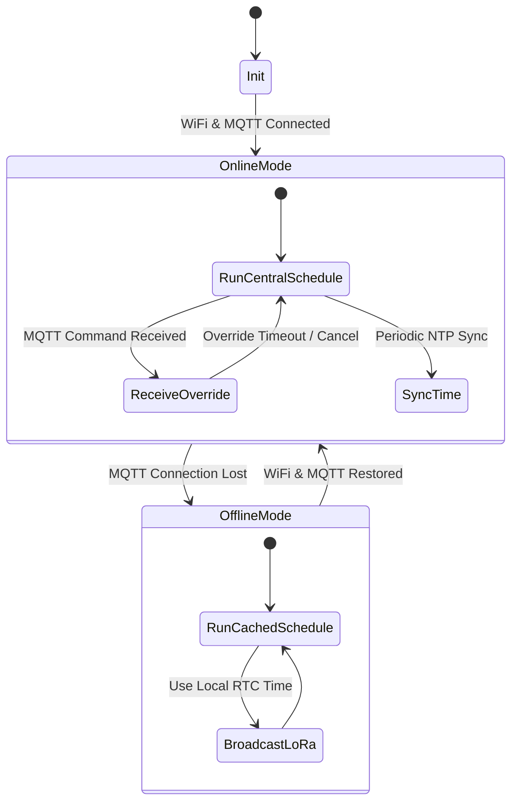

# ESP-32 Traffic Controller

The **ESP-32 Traffic Controller** is the master coordination unit for an intersection group. It acts as the local bridge between the central backend (via MQTT over WiFi/Ethernet) and the individual intersection Raspberry Pi Edge Devices (via local LoRa radio broadcasts). 

Its primary purpose is to ensure that coordinated traffic light signaling remains functional and synchronized within the group even in the event of local or system-wide internet outages.

## Responsibilities

*   **Schedule Synchronization:** Connects to the backend via MQTT to receive updated daily traffic schedules, phase definitions, and coordination configurations.
*   **Signal Override Execution:** Receives real-time manual override commands from operators via the backend and applies them to the active phase calculation immediately.
*   **LoRa Phase Broadcasting:** Computes the active traffic light state for all intersections in its group and broadcasts the target states to the Raspberry Pi actuators via LoRa.
*   **Offline Resilient Scheduling:** In the event of an internet outage, automatically transitions to offline mode, executing schedules locally using its battery-backed Real-Time Clock (RTC).
*   **Fallback Status Telemetry:** When edge devices lose internet connection but the controller is online, the ESP-32 publishes the current active traffic light phases of the group to the backend so status remains visible.
*   **Status & Heartbeat Reporting:** Publishes its own connection status and health parameters to the backend.

## Technology Stack

| Component               | Technology                                             |
| ----------------------- | ------------------------------------------------------ |
| Microcontroller         | ESP32-WROOM-32D / ESP32-S3                             |
| Operating System/Core   | FreeRTOS / ESP-IDF (C++) or Arduino Core for ESP32     |
| Local Radio Transceiver | SX1276 / SX1278 LoRa Module (e.g., HopeRF RFM95W)      |
| Network Connectivity   | Integrated WiFi (2.4 GHz) or SPI-connected Ethernet PHY|
| Time Keeping            | DS3231 External Precision RTC with Battery Backup      |
| Storage                 | ESP32 NVS (Non-Volatile Storage) for schedules & logs  |
| Protocol (Backend)      | MQTT over TLS v1.3                                     |
| Protocol (Local Radio)  | LoRa Broadcast (group-frequency / ID locked)           |
| Data Format (Backend)   | JSON                                                   |
| Data Format (Radio)     | Compact JSON or Binary Byte Array                      |

## LoRa Communication Specification

LoRa communication operates locally in a broadcast-only topology from the ESP-32 Traffic Controller (Master) to the Raspberry Pi Edge Devices (Slaves) within a localized group.

### Radio Configuration

*   **Frequency Bands:** Region-dependent (e.g., 915 MHz for North America, 868 MHz for Europe, 433 MHz for general use).
*   **Addressing/Isolation:** To prevent cross-group interference (signal leakage from neighboring intersection groups), each group uses:
    1.  A group-specific frequency sub-channel.
    2.  A unique **Group ID** token in the packet header which receiving Raspberry Pis use to filter broadcasts.
*   **Packet Interval:** The ESP-32 broadcasts the signal state every 1 second as a heartbeat, and immediately sends a burst of 3 packets on any phase change to guarantee reception.

### Sample LoRa Packet Payload (JSON Representation)

```json
{
  "gid": "group-01",
  "seq": 10542,
  "ts": 1782806400,
  "p": {
    "intersection-01": "NS_GREEN_EW_RED",
    "intersection-02": "NS_RED_EW_GREEN"
  },
  "ttl": 15
}
```

| Field | Type | Description |
| --- | --- | --- |
| `gid` | String | Group Identifier to isolate groups on the same frequency. |
| `seq` | Integer | Incrementing packet sequence number to reject duplicate/stale packets. |
| `ts` | Integer | Unix epoch timestamp generated by the ESP-32's RTC. |
| `p` | Object | Map of intersection IDs within the group to their target active phase. |
| `ttl` | Integer | Time-To-Live in seconds for the current phase (time remaining in the cycle). |

## Offline Resilience Flow

The ESP-32 controller manages transition states autonomously depending on internet availability:



### Transition & Fallback Details

1.  **Time Synchronization:** While online, the ESP-32 regularly syncs its internal clock with NTP servers and updates the hardware DS3231 RTC. When offline, it relies entirely on the DS3231 RTC.
2.  **Schedule Caching:** Daily schedule profiles and coordination phase plans are saved in the ESP-32's Non-Volatile Storage (NVS). When connection is lost, it falls back to the plan corresponding to the current time retrieved from the RTC.
3.  **Connection Recovery:** The ESP-32 executes connection retry attempts in a background thread, ensuring that failure to connect to WiFi/MQTT does not block the primary LoRa broadcasting task.
